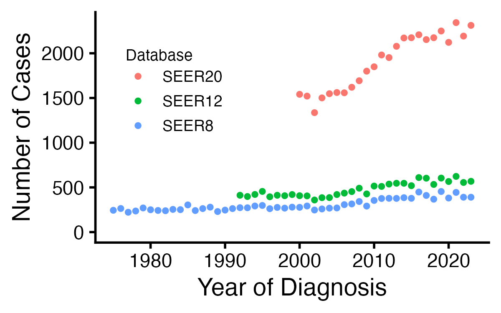
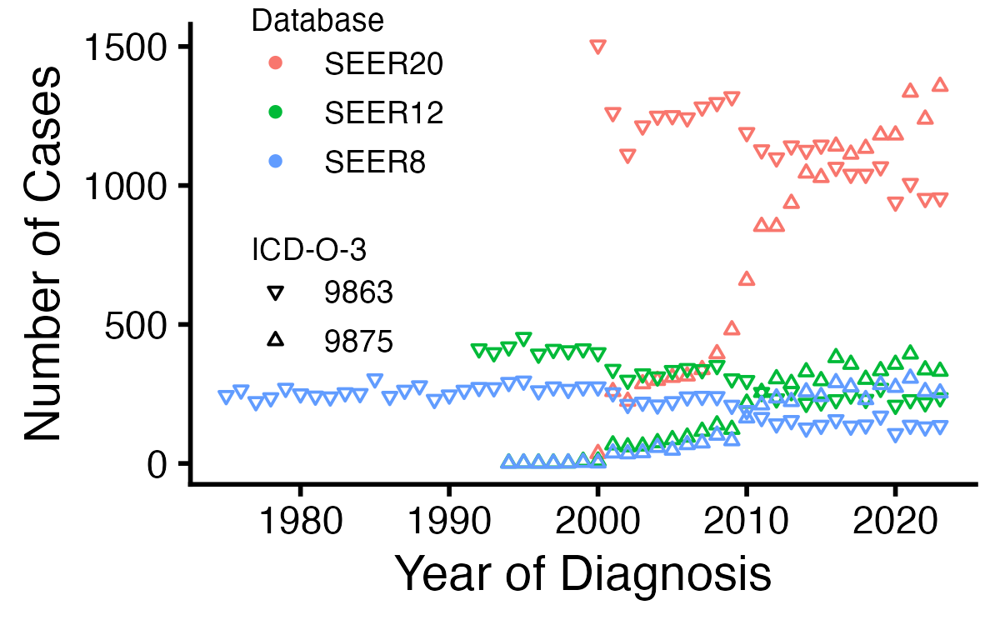
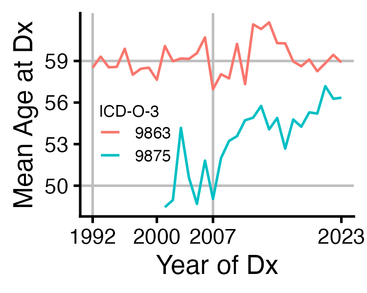
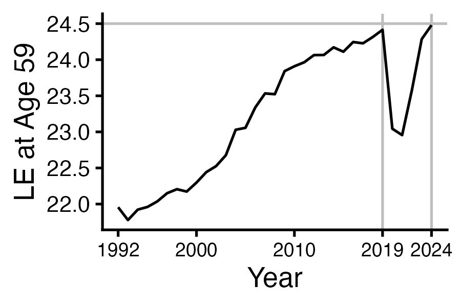
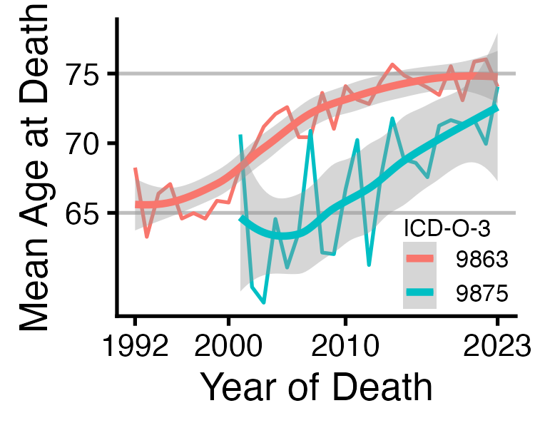
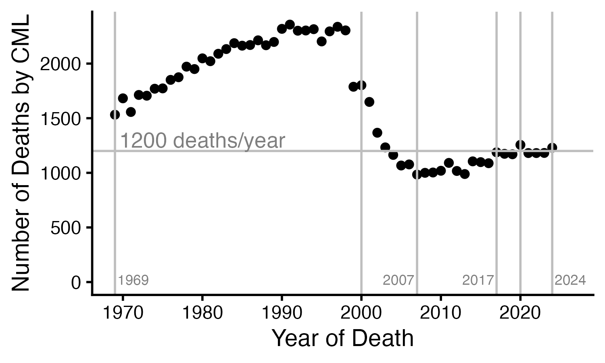
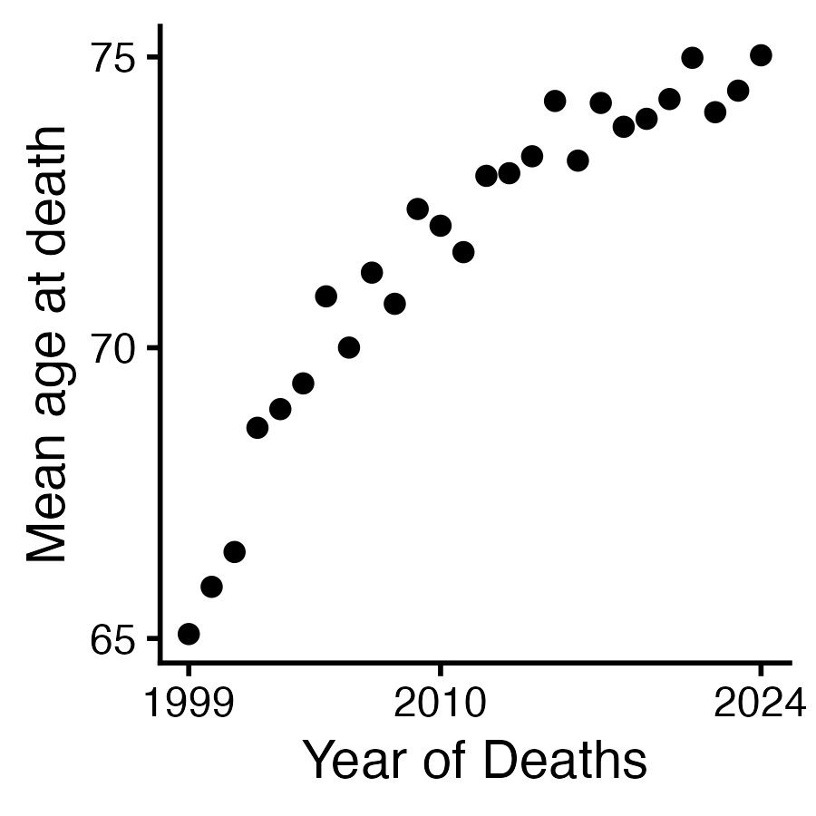
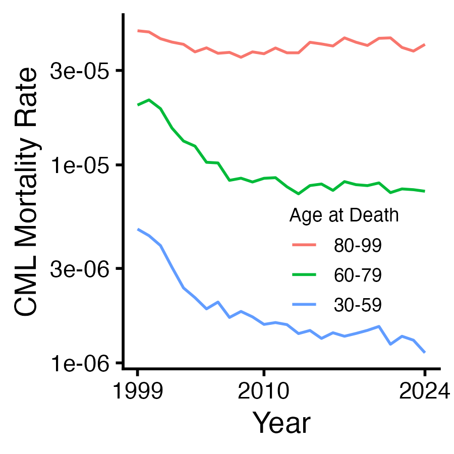

# CMLepi

<!-- badges: start -->
[](https://github.com/radivot/CMLepi/actions/workflows/R-CMD-check.yaml)
<!-- badges: end -->

The immediate goal of CMLepi is to help people estimate chronic myeloid leukemia (CML) patient life expectancies (LEs) from 
Surveillance Epidemiology and End Results (SEER) data. 

## Installation

You can install the development version of CMLepi like so:

``` r
remotes::install_github("radivot/CMLepi")
```

To use it you must first gain access to the SEER data via a Windows program called SEER\*stat. 
This involves requesting access (no need for the Plus version) and waiting a day to get it. 
Once you have it,  work through the SEER\*Stat Case Listing tutorial and create one using 
Incidence - SEER Research Data, 8 Registries, Nov 2025 Sub (1975-2023), i.e. SEER8. Select 
cases by Site and Morphology.Site recode ICD-O-3/WHO 2008 = Chronic Myeloid Leukemia and choose as 
column variables: Patient ID, Sex, Age recode with single ages and 90+, 
Year of diagnosis, ICD-O-3 Hist/behav, Survival Days, and COD to site recode. Execute the session. When it
completes, select all, right-click on the header, pick display unformatted, and
export to the files `cml8.txt` and `cml8.dic`. Repeat this changing the database to SEER12 and 
SEER20 (i.e. SEER21 excluding IL) and save the results to `cml12.txt/cml12.dic` and `cml20.txt/cml20.dic`. Put these six
files in the folder `~/data/CMLepi`.


## Introduction

Bringing dic/txt file pairs into single R tibbles is done using `seer2r()`. This function is a wrapper around 
R package **SEER2R**'s function `read.SeerStat()`. The following work is done by `seer2r()`. 
``` r
# pak::pak("cran/SEER2R") #installs fine from  GitHub even though no longer on CRAN
library(SEER2R)
n8 = read.SeerStat("~/data/CMLepi/cml8.dic",UseVarLabelsInData=FALSE) #get numbers(n)
head(n8<-attr(n8,"assignColNames")(n8,c("id","sex","Age","Year","ICDO3","surv","COD")))
library(tidyverse)
(n8=n8|>rename(yrdx=Year,agedx=Age)|>as_tibble())
n8=n8|>mutate(yrdx=yrdx+1800,surv=surv/365.25)
n8=n8|>mutate(status=as.numeric(COD>0),.after=surv)
n8=n8|>mutate(sex=ifelse(sex==1,"Male","Female"))
(n8=n8|>mutate(sex=as_factor(sex)))

c8 = read.SeerStat("~/data/CMLepi/cml8.dic",UseVarLabelsInData=TRUE) 
head(c8<-attr(c8,"getSubDataByVarName")(c8,c("ICDO3","site")))
(c8=c8|>rename(histS=ICDO3,CODS=site)|>as_tibble())
(d8=bind_cols(n8,c8))
(d8=d8|>mutate(histo3=as.numeric(str_sub(histS,end=4)),.after=ICDO3))
table(d8$histo3)
#  9863  9875  9876  9945  9946 
# 10856  4065   116  4331    63
d8=d8|>filter(histo3%in%c(9863,9875,9945)) #leave out rare jCMML=9946 and atypical CML=9876
table(d8$histo3,d8$yrdx)
#      1975 1976 1977 1978 1979 1980 1981 1982 1983 1984 1985 1986 1987 1988 1989 1990 1991
# 9863  244  264  222  237  270  250  242  239  254  251  304  241  263  279  230  246  263
# 9875    0    0    0    0    0    0    0    0    0    0    0    0    0    0    0    0    0
# 9945    0    0    0    0    0    0    0    0    0    1    0   34   34   33   42   45   63
#
#      1992 1993 1994 1995 1996 1997 1998 1999 2000 2001 2002 2003 2004 2005 2006 2007 2008
# 9863  273  273  291  296  261  275  266  275  275  254  212  220  210  222  239  241  240
# 9875    0    0    1    2    1    1    2    4    2   38   35   39   58   48   68   74  102
# 9945   50   70   72   76   90   95   72   98   91   89  111  109  121   95  108  111  103
#
#      2009 2010 2011 2012 2013 2014 2015 2016 2017 2018 2019 2020 2021 2022 2023
# 9863  209  190  165  142  154  127  137  157  134  138  170  107  137  131  136
# 9875   82  164  211  236  223  258  241  291  276  230  284  274  307  259  254
# 9945  143  121  132  122  144  150  145  163  182  181  184  185  221  198  247
(d8=d8|>mutate(cancer=ifelse(histo3%in%c(9863,9875),"CML","CMML"),.after=histo3))
(d8=d8|>select(-histS))
(d8=d8|>mutate(COD2=ifelse(COD==0,"alive",ifelse((COD>=74)&(COD<=85)|(COD==89),"LC","OC")),.after=COD))
(d8=d8|>mutate(CODS=as_factor(CODS))) #to save a little memory

mapCOD7=function(D){
  COD=D$COD #start with vec of integers. Map to a vec of Strings
  CODt=rep("UNK",dim(D)[1]) #set default to "unknown" type of death
  CODt[COD==0]="alive"
  CODt[(COD>=1)&(COD<=73)|(COD==86)|(COD==90)]="CA"
  CODt[(COD>=74)&(COD<=85)|(COD==89)]="LC"
  CODt[COD==130]="CA" #in situ (benign)
  CODt[(COD>=133)&(COD<=145)]="IN" # infection
  CODt[COD==148]="DK"  # diabetes
  CODt[COD==151]="YOC"  # alzheimers -> yet other causes
  CODt[COD==154]="CV"  # heart disease
  CODt[COD==157]="CV" # hypertension without HD
  CODt[COD==160]="CV"  #cerebroVasc"
  CODt[COD==163]= "CV" #"athero"
  CODt[COD==166]= "CV"     #"aoritic aneurysm"
  CODt[COD==169]= "CV"  #"other disease of Vasc"
  CODt[COD==172]= "IN" #"pneumonia"
  CODt[COD==175]="YOC" # COPD, no signal so smoking makes both. chronic obstructive pulminary disease
  CODt[COD==178]="YOC" # ulcer
  CODt[COD==181]="YOC" # liver disease
  CODt[COD==184]="DK" # kidney disease
  CODt[COD==199]="ASH" #"accidents"
  CODt[COD==202]="ASH"  #"suicide"
  CODt[COD==205]="ASH" # homocide"
  CODt[COD%in%c(187,190,193)]="YOC" # perinatal conditions
  CODt[COD%in%c(196,208,252)]="YOC" # other causes, including ill-defined and unknown
  # CODt[COD==252]="UNK" # same if no comment => all accounted for
  D$COD7=as.factor(CODt)
  D|>relocate(COD7, .after = COD2)
}

(d8=mapCOD7(d8))
# # A tibble: 19,252 × 13
#      id sex    agedx  yrdx ICDO3 histo3 cancer  surv status   COD COD2  COD7  CODS                          
#   <int> <fct>  <int> <dbl> <int>  <dbl> <chr>  <dbl>  <dbl> <int> <chr> <fct> <fct>                         
# 1  2075 Female    80  1990  7783   9945 CMML    1.79      1    78 LC    LC    Chronic Myeloid Leukemia      
# 2  2226 Male      86  1988  7455   9863 CML     1.11      1   154 OC    CV    Diseases of Heart             
# 3  4093 Female    50  1989  7455   9863 CML     8.10      1   154 OC    CV    Diseases of Heart             
# 4  5253 Female    71  2002  7455   9863 CML    14.0       1   208 OC    YOC   Other Cause of Death          
# 5  6614 Female    81  2014  7783   9945 CMML    1.68      1    85 LC    LC    Aleukemic, Subleukemic and NOS
# 6  8674 Male      63  1998  7503   9875 CML     3.72      1    78 LC    LC    Chronic Myeloid Leukemia      
# 7  8686 Female    77  1998  7455   9863 CML     4.39      1    78 LC    LC    Chronic Myeloid Leukemia      
# 8  8767 Male      51  1995  7455   9863 CML     3.67      1    78 LC    LC    Chronic Myeloid Leukemia      
# 9  8938 Male      58  1997  7455   9863 CML     6.16      1    78 LC    LC    Chronic Myeloid Leukemia      
#10  8958 Male      52  1997  7455   9863 CML     4.36      1    78 LC    LC    Chronic Myeloid Leukemia      
```

We use `seer2r()` to make SEER CML incidence binary files that load much faster 
downstream as follows. 


``` r
# mkSEERincid.R  (name of this R script)
library(tidyverse)
library(CMLepi)
system.time({
  d8=seer2r("cml8")
  save(d8,file="~/data/CMLepi/cml8.RData")
  d12=seer2r("cml12")
  save(d12,file="~/data/CMLepi/cml12.RData")
  d20=seer2r("cml20")
  save(d20,file="~/data/CMLepi/cml20.RData")
})  # 10 secs
load("~/data/CMLepi/cml8.RData")
load("~/data/CMLepi/cml12.RData") 
load("~/data/CMLepi/cml20.RData") 

######## using prevalence sessions in SEER*stat I get on jan1 2023, pop average of 2022 and 2023 is 140,038,579.0
# total is (336.75+334)/2 = 335   based on https://www.multpl.com/united-states-population/table/by-year
335/140.04 #2.392 = multiplier for SEER20 pop of 140,038,579.0
2.392*25451 #61k (histo3 sum)   23-year limited duration prevalence
335/40.355 #8.3 is multiplier  SEER12 pop of 40,355,231.5
8.3*7419.4 #61.5 k     31-year limited duration prevalence
335/27.69 #12.1 is multiplier for SEER8 pop of 27,692,133.5
12.1*5205.2 #63k  48-year limited duration prevalence. Why not 66k? why not use 5500 alive at end of 2023?
# maybe they think loss of follow up doesn't mean confirmed alive, just not confirmed dead yet ... tut 1 supports this  

dc=d8|>filter(yrdx<2000,cancer=="CML")
(dc=dc|>mutate(year=yrdx+surv,status=ifelse(year>2000,0,1)))
table(dc$status) # 1206 alive; 12*1206 = 14472 is prevalence of cases alive entering 2000 
dc=d8|>filter(cancer=="CML")
table(dc$status) # 5500 alive, 9419 dead;12*5500 = 66000 is prevalence on dec31 2023

# now getnumbers of new cases per year in the entire US based on numbers in each the 3 databases
round(table(d8$cancer,d8$yrdx)*12.1)
#      1975 1976 1977 1978 1979 1980 1981 1982 1983 1984 1985 1986 1987 1988 1989 1990 1991 1992 1993 1994 1995 1996 1997 1998 1999 2000
# CML  2952 3194 2686 2868 3267 3025 2928 2892 3073 3037 3678 2916 3182 3376 2783 2977 3182 3303 3303 3533 3606 3170 3340 3243 3376 3352
# CMML    0    0    0    0    0    0    0    0    0   12    0  411  411  399  508  544  762  605  847  871  920 1089 1150  871 1186 1101

#      2001 2002 2003 2004 2005 2006 2007 2008 2009 2010 2011 2012 2013 2014 2015 2016 2017 2018 2019 2020 2021 2022 2023
# CML  3533 2989 3134 3243 3267 3715 3812 4138 3521 4283 4550 4574 4562 4658 4574 5421 4961 4453 5493 4610 5372 4719 4719
# CMML 1077 1343 1319 1464 1150 1307 1343 1246 1730 1464 1597 1476 1742 1815 1754 1972 2202 2190 2226 2238 2674 2396 2989

round(table(d12$cancer,d12$yrdx)*8.3)
#      1992 1993 1994 1995 1996 1997 1998 1999 2000 2001 2002 2003 2004 2005 2006 2007 2008 2009 2010 2011 2012 2013 2014 2015 2016 2017
# CML  3420 3312 3494 3777 3279 3420 3378 3486 3378 3362 2980 3196 3204 3486 3619 3760 4075 3544 4274 4241 4457 4532 4532 4308 5063 5005
# CMML  622  805  797  930 1021 1087  872 1112 1029 1071 1170 1237 1270 1154 1320 1212 1237 1519 1386 1411 1328 1519 1685 1594 1751 2025

#      2018 2019 2020 2021 2022 2023
# CML  4424 5013 4698 5171 4606 4714
# CMML 2108 2224 2050 2523 2258 2872

round(table(d20$cancer,d20$yrdx)*2.4) 
#      2000 2001 2002 2003 2004 2005 2006 2007 2008 2009 2010 2011 2012 2013 2014 2015 2016 2017 2018 2019 2020 2021 2022 2023
# CML  3698 3650 3206 3605 3715 3746 3739 3888 4063 4320 4438 4754 4687 4987 5210 5218 5297 5167 5218 5398 5093 5623 5261 5549
# CMML  883  926  934 1068 1044 1013 1099 1116 1154 1363 1354 1433 1313 1606 1651 1606 1819 1819 1939 2134 2076 2318 2278 2645
```
Thus, there are ~5000 new cases of CML per year in the US and the prevalence of CML is ~66000.  The 
average LE is thus >13.2 (=66k/5k) years, as the system may not yet be at steady state.


## SEER Incidence Data

SEER Incidence Data binaries produced above can be used to plot counts of new CML cases per year. The first 
plot shows the sum of cases defined by either the older code 9863 (based on detection of the Philadelphia Chromosome)
or the newer code 9875 (based on detection of *BCR::ABL1*). The second plot shows counts for each code separately. In it, while 9875 use is on 
the rise, 9863 use is not vanishing. The following script also 
shows that there is substantial misclassification of deaths by CML as deaths by other leukemias.

``` r
# 1_SEERdata.R  (makes Figure 1A and 1B of a CML LE paper in the works)
graphics.off();rm(list=ls()) 
library(tidyverse)
load("~/data/CMLepi/cml20.RData") 
head(d20<-d20%>%filter(histo3%in%c(9863,9875))) #45636
d20$db="SEER20"
D20=d20|>summarize(n=n(),.by = c(yrdx, histo3,db))|>mutate(histo3=factor(histo3))

load("~/data/CMLepi/cml12.RData") 
head(d12<-d12%>%filter(histo3%in%c(9863,9875))) #15325 
d12$db="SEER12"
D12=d12|>summarize(n=n(),.by = c(yrdx, histo3,db))|>mutate(histo3=factor(histo3))

load("~/data/CMLepi/cml8.RData") 
head(d8<-d8%>%filter(histo3%in%c(9863,9875))) #14919 
d8$db="SEER8"
D8=d8|>summarize(n=n(),.by = c(yrdx, histo3,db))|>mutate(histo3=factor(histo3))
D=bind_rows(D20,D12,D8)|>mutate(db=as_factor(db)) 
Dtot=D|>summarize(n=sum(n),.by = c(yrdx,db))
myt=theme(
  legend.key.size = unit(0.5, "cm"),
  legend.position = c(0.2,0.65),
  legend.text = element_text(size = 9),
  legend.title = element_text(size = 9, margin = margin(b = 1, unit = "pt")),
  legend.key.spacing.y = unit(0.0, "cm"),
  legend.margin = margin(t = 0, r = 0, b = 0, l = 0, unit = "pt")) 
Dtot|>ggplot(aes(x=yrdx,y=n,col=db))+geom_point(size=1)+
  labs(y="Number of Cases",x="Year of Diagnosis",col="Database")+
  ylim(c(0,NA))+theme_classic(base_size=14)+ myt
ggsave("LE/outs/1A_caseCounts.pdf",width=4,height=2.5) #for paper
ggsave("LE/outs/1A_caseCounts.png",width=4,height=2.5) #for GitHub

D|>ggplot(aes(x=yrdx,y=n,col=db,shape=histo3))+geom_point(size=1)+
  labs(y="Number of Cases",x="Year of Diagnosis",col="Database",shape="ICD-O-3")+
  scale_shape_manual(values = c(6,2))+
  ylim(c(0,NA))+theme_classic(base_size=14)+myt
ggsave("LE/outs/1B_countsByCodes.pdf",width=4,height=2.5) #for paper
ggsave("LE/outs/1B_countsByCodes.png",width=4,height=2.5) #for GitHub

d=bind_rows(d20,d12,d8) #75880
d=d|>distinct(pick(-db)) # don't count it as different via db being different
d # 53254 unique cases = number in figure legend; others there were read off by eye

hist(d$surv) #outlier cluster past 80 are unknown survival times
(du=d|>filter(surv>80)) # 668 with unknown survival times = 89.7
table(du$status) # 666 of 668 are dead
(d0=d|>filter(surv==0)) #261 likely left registry area right after Dx
table(d$agedx)

dOld=d|>filter(agedx>=90) #1295
table(dOld$status)# 91 alive, 1204 dead
table(dOld$COD2) #635 by LC, 569 by OC
dOldOC=dOld|>filter(COD2=="OC")
sort(table(dOldOC$CODS)) # heart=223, cerebroVasc=25, athero=11 => 223+25+11=259 in text
table(dOld$COD7) #263 by CVD (3 more via hypertension + 1 via aortic aneurism)
table(dOld$status,dOld$yrdx) # tells us to take it up thru 2017 to have most cases dead
dOld=dOld|>filter(surv<80) # 1159 => lost 136 to survival unknown
dOld=dOld|>filter(surv>0) # 1135  => lost 24 more to survival = 0
dOld|>group_by(yrdx)|>summarize(mn=mean(surv))|>t() # and 2017 is where LE peaks before censoring brings it back down
dOld=dOld|>filter(yrdx<=2017)
table(dOld$status) # 870 dead, 8 still alive
(dOld=dOld|>mutate(yrG=cut(yrdx,breaks=c(1975,1990,2000,2005,2011,2017),include.lowest=T,dig.lab=4)))
dOld|>group_by(yrG)|>summarize(mn=mean(surv),sd=sd(surv)) 
summary(lm(surv~yrdx,data=dOld))
summary(lmG<-lm(surv~0+yrG,data=dOld))
(ci=round(cbind(coef(lmG),confint(lmG)),2))
paste0(ci[,1]," (",ci[,2],", ",ci[,3],")",collapse=", ")
# "1.02 (0.67, 1.38), 0.92 (0.6, 1.24), 1 (0.73, 1.27), 1.32 (1.08, 1.57), 1.81 (1.58, 2.03)"
1/3.8 #26%
1.81/4.0 #45%
table(d20$COD2) # 8194 by leukemia
table(d20$CODS) 
table(d20$CODS=="Chronic Myeloid Leukemia")       # 5210 by CML
table(d20$CODS=="Aleukemic, Subleukemic and NOS") # 1117 by sub-Leu
table(d20$CODS=="Acute Myeloid Leukemia")          # 772 by AML
table(d20$CODS=="Acute Monocytic Leukemia")        # 8 AMoL => AML=780
table(d20$CODS=="Chronic Lymphocytic Leukemia")   # 220 by CLL
table(d20$CODS=="Acute Lymphocytic Leukemia")     # 134 by ALL
table(d20$CODS=="Other Myeloid/Monocytic Leukemia") # 488 by OML
table(d20$CODS=="Other Acute Leukemia")          # 226 by OAL
table(d20$CODS=="Other Lymphocytic Leukemia") # 19 OLL
1117+772+8+220+134+488+226+19 # 2984
488+226+19 #733 by OL
1117+780+220+134+733#2984 = sum of subleu=1117,AML=780,CLL=220,ALL=134,OL=733
8194*2.4# 19665.6 US CML patient deaths by a leukemia in 2000-2023 among those Diagnosed in 2000-2023
# to put this in perspective, 2984 deaths by other leukemias is way too high relative to  
table(d20$CODS=="Lung and Bronchus")# 351 lung cancer deaths

```
The figures produced by the script above are




A sharp rise in 9875 cases around 2010 was not accompanied by nearly as sharp a fall in 9863 cases, so it 
seems sensitive tests led to additional diagnoses (i.e. totals surging).  It is unclear if the additional 
cases are healthy normal people being overdiagnosed (and thus overtreated) or cases that would have otherwise been diagnosed as having 
a different myeloproliferative neoplasm such as chronic myelomonocytic leukemia (CMML).  


## Model-Free LE Estimation

Focusing on cases defined by code 9863 the script below shows that the mean age 
at diagnosis held flat at 59 years while the mean age at death leveled off at 75 years. 
Thus, CML patient LEs are roughly 16 years on average. 


``` r
# 4_yearsLost.R   (This script produces Figures 4A, 4B and 4C of an upcoming CML LE paper)
graphics.off();rm(list=ls()) 
library(tidyverse)
tc=function(sz) theme_classic(base_size=sz)
load("~/data/CMLepi/cml12.RData") 
head(d<-d12%>%filter(histo3%in%c(9863,9875))) #15325 
table(d$histo3,d$yrdx) #see new code really only starts in 2001 
d=d|>filter(histo3==9863|(histo3=9875)&(yrdx>2000)) 
(d=d|>mutate(histo3=as_factor(histo3)))
D=d|>group_by(yrdx,histo3)|>summarize(mage=mean(agedx))#both 
gh=geom_hline(yintercept=c(50,59),col="gray")
gv=geom_vline(xintercept=c(1992,2007),col="gray")
myt=theme(
  legend.key.size = unit(0.4, "cm"),
  legend.position = c(0.20,0.4),
  legend.text = element_text(size = 8),
  legend.title = element_text(size = 8, margin = margin(b = 1, unit = "pt")),
  legend.key.spacing.y = unit(0.0, "cm"),
  legend.margin = margin(t = 0, r = 0, b = 0, l = 0, unit = "pt")
)
D|>ggplot(aes(x=yrdx,y=mage,group=histo3,col=histo3)) + gh + gv + geom_line()+tc(13)+
  labs(y="Mean Age at Dx",x="Year of Dx",col="ICD-O-3")+
  scale_x_continuous(breaks=c(1992,2000,2007,2023))+
  scale_y_continuous(breaks=c(50,53,56,59))+myt
ggsave("LE/outs/4A_dxAges.pdf",width=2.5,height=2) 
ggsave("LE/outs/4A_dxAges.png",width=2.5,height=2) 

# get life expectancy at 59 as function of years
# https://github.com/robjhyndman/vital  updated for US HMD data
library(vital)  
library(tsibble)
files=c("Deaths_1x1.txt", "Exposures_1x1.txt", "Population.txt", "Mx_1x1.txt")
files=paste0("~/data/hmd_countries/USA/stats/",files) #put files above from HMD into here
us_mort=read_hmd_files(files) # function in R package vital
# save(us_mort,file="~/data/mrt/us_mort.RData")
# load("~/data/mrt/us_mort.RData")
(D=us_mort |>filter(Sex == "Total", Year >= 1992)|>life_table()|>filter(Age==59))
gh=geom_hline(yintercept=24.5,col="gray")
gv=geom_vline(xintercept=c(2019,2024),col="gray")
D|>ggplot(aes(x=Year,y=ex))+gh+gv+ 
  geom_line()+tc(13)+labs(y="LE at Age 59",x="Year") + 
  scale_x_continuous(breaks=c(1992,2000,2010,2019,2024))+
  theme(axis.text.x = element_text(size = 9) )
ggsave("LE/outs/4B_normalLEs.pdf",width=3,height=2)
ggsave("LE/outs/4B_normalLEs.png",width=3,height=2)

head(d<-d12%>%filter(histo3%in%c(9863,9875))) #15325 
d=d|>mutate(surv=ifelse(surv>50,0,surv)) 
table(d$histo3,d$yrdx)
d=d|>filter(histo3==9863|(histo3=9875)&(yrdx>2000)) # >50 deaths by 9875 after year 2000
(Dt=d|>mutate(ageDth=surv+agedx)) 
(Dt=Dt|>mutate(yrDth=floor(surv+yrdx),histo3=as_factor(histo3)))
(Dt=Dt|>filter(status==1))
(DT=Dt|>group_by(yrDth,histo3)|>summarize(mage=mean(ageDth)))
gh=geom_hline(yintercept=c(65,75),col="gray")
DT|>ggplot(aes(x=yrDth,y=mage,group=histo3,col=histo3)) + gh + geom_line()+tc(13)+
  labs(y="Mean Age at Death",x="Year of Death",col="ICD-O-3") + 
  scale_y_continuous(breaks=seq(65,75,5))+geom_smooth()+
  scale_x_continuous(breaks=c(1975,1986,1992,2000,2010,2023))+ myt +
theme(legend.position = c(0.85,0.18))
ggsave("LE/outs/4C_deathsAges.pdf",width=2.5,height=2)
ggsave("LE/outs/4C_deathsAges.png",width=2.5,height=2)

```


The figures produced by the script above are





Thus, given a mean age at diagnoses of 59 and a normal LE at 59 of 24.5 years, ages at death 
leveling at ~75 years implies LEs of 16 years and ~8 years (or one-third) of life lost, on average. 


## Nationwide Numbers and Ages of Deaths by CML

To explore numbers of deaths by CML nationwide create a SEER\*Stat Frequency Session using (as data)
Mortality - All COD, Aggregated Total U.S. (1969-2024) <Katrina/Rita Population Adjustment>.
Select deaths using Site and Morphology.Cause of death recode with COVID-19 = Chronic Myeloid Leukemia, make a Table
with Age recode with <1 year olds and 90+ in rows and Year of Death in columns, execute it, and export it 
to `CMLdeaths.txt` and `CMLdeaths.dic.` Place these files in `~/data/CMLepi.`  You can then run the following script.

``` r
# 2_MortalityDataAB.R
library(tidyverse)
# In SEER*stat, use a frequency session to create the mortality table.
# Note that case listing makes no sense here since there is no individual level mortality data 
nms=c("a20","year","count")
system.time(d <-read_tsv("~/data/CMLepi/CMLdeaths.txt", col_names=nms)) #
d=d|>mutate(age=ifelse(a20==19,92.5,ifelse(a20==0,0.5,ifelse(a20==1,3,(a20-1)*5+2.5))))
d=d|>mutate(year=year+1968)
d=d|>filter(year!=1968,a20!=20)  #1968 is the sum over all years 
head(d)
#     a20  year count   age
#   <dbl> <dbl> <dbl> <dbl>
# 1     0  1969     1   0.5
# 2     0  1970     4   0.5
sum(d$count) # 92610
d|>group_by(year)|>summarize(n=sum(count))|>
  ggplot(aes(x=year,y=n))+geom_point()+labs(y="Number of Deaths by CML",x="Year of Death")+
  ylim(c(0,NA))+theme_classic(base_size=14)+
  geom_hline(yintercept=c(1200),col="gray")+
  annotate('text',x=1980,y=1300,label='1200 deaths/year',col="gray50",size=4.5)+
  annotate('text',x=2004.7,y=20,label='2007',col="gray50",size=3)+
  annotate('text',x=2014.7,y=20,label='2017',col="gray50",size=3)+
  annotate('text',x=2026.3,y=20,label='2024',col="gray50",size=3)+
  annotate('text',x=1971.3,y=20,label='1969',col="gray50",size=3)+
  geom_vline(xintercept=c(1969,2000,2007,2017,2020,2024),col="gray")
ggsave("LE/outs/2A_deathCounts.pdf",width=5,height=3)
ggsave("LE/outs/2A_deathCounts.png",width=5,height=3)
d|>group_by(year)|>summarize(mage=weighted.mean(age,count))|> filter(year>1998)|>
  ggplot(aes(x=year,y=mage))+geom_point()+labs(y="Mean age at death",x="Year of Deaths")+
  scale_y_continuous(breaks=c(65,70,75))+
  scale_x_continuous(breaks=c(1999,2010,2024))+
  theme_classic(base_size=14)
ggsave("LE/outs/2B_deathAges.pdf",width=3,height=3)  
ggsave("LE/outs/2B_deathAges.png",width=3,height=3)  
## Compare death counts in 2000-2023 nationwide to those estimated via SEER incidence COD info.
d|>filter(year%in%c(2000:2023))|>summarize(n=sum(count)) #total of 28085 deaths by CML in 2000-2023
5210*2.4# 12.5k by CML with Dx in 2000-2023 + 14.5k alive in 2000 implies an upper limit of 27k dead by CML. 
# 19.5k + 14.5k = 34k is at least greater than 28k, so Mortality data likely fixed the problem of missclassifications  
# of deaths as by other leukemias in the Incidence Data. It likely also does a better job of picking up
# deaths by intense therapy of intense disease, as 8.5k deaths by CML out of 14.5k alive in 2000 still seems high.  
# Unclear is if the 28k deaths include any via higher rates of CVD deaths caused by chronic use of tyrosine kinase inhibitors. 

```

This produces a plot that shows a large drop in 1999 due to removal of CMML from the definition of CML,
tyrosine kinase inhibitor (TKI) mediated drops that started in 2001, and now, ~1200 US deaths by CML each year.  

Also seen via this script is plateauing of the mean age at death, perhaps to ~75 years.  


## Nationwide CML Mortality Rates

To plot nationwide CML mortality rates start a SEER\*Stat Rate Session and using 
Mortality - All COD, Aggregated Total U.S. (1969-2024) <Katrina/Rita Population Adjustment> make a Table
with Cause of death recode with COVID-19 as pages, Age recode with <1 year olds and 90+ as rows and Year of Death as columns.
Execute and export it to `rates.txt` and `rates.dic`. Place these files in `~/data/CMLepi`.  You can then run this script.

``` r
# 2_MortalityDataC.R  #### shows death rate drops in 80's being small 
library(tidyverse)
nms=c("COD","a20","year","rate","num","denom")
d=read_tsv("~/data/CMLepi/rates.txt", col_names=nms) 
d=d|>mutate(age=ifelse(a20==19,92.5,ifelse(a20==0,0.5,ifelse(a20==1,3,(a20-1)*5+2.5))))
d=d|>mutate(year=year+1968)
d=d|>filter(year!=1968,a20!=20)  #1968 is the sum over all years 
d=d|>filter(COD==78) # 78="        Chronic Myeloid Leukemia" (see rates.dic file)
(d=d|>filter(age>=30))
(d=d|>filter(year>=1999))
(D=d|>mutate(Age=cut(age,c(30,60,80,100)))|>group_by(year,Age)|>summarize(n=sum(num),d=sum(denom)))
dput(levels(D$Age))
(ord=c("(30,60]", "(60,80]", "(80,100]")[3:1])
labs=c("30-59", "60-79", "80-99")[3:1]
D=D|>mutate(incid=n/d,Age=factor(Age,levels=ord,labels=labs))
dput(levels(D$Age))
lh=theme(legend.direction="horizontal")
D|>ggplot(aes(x=year,y=incid,col=Age))+geom_line()+
  labs(y="CML Mortality Rate",x="Year",col="Age at Death")+scale_y_log10() +
  scale_x_continuous(breaks=c(1999,2010,2024))+theme_classic(base_size=14)+
  theme(
    legend.key.size = unit(0.5, "cm"),
    legend.position = c(0.70,0.3),
    legend.text = element_text(size = 9),
    legend.title = element_text(size = 9, margin = margin(b = 3, unit = "pt")),
    legend.key.spacing.y = unit(0.0, "cm"),
    legend.margin = margin(t = 0, r = 0, b = 0, l = 0, unit = "pt")
  )
ggsave("LE/outs/2C_noHelpAt80.pdf",width=3,height=3)
ggsave("LE/outs/2C_noHelpAt80.png",width=3,height=3)

```

This produces a plot that shows very little prevention of death by CML in elderly populations. 

Values are small, as they are rate-limited by CML incidence.  
